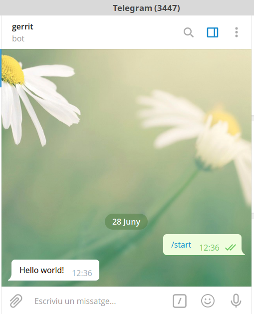
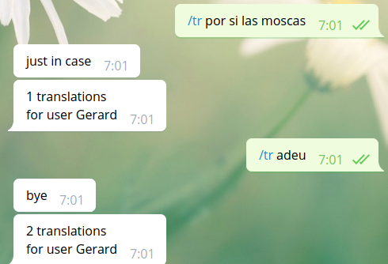
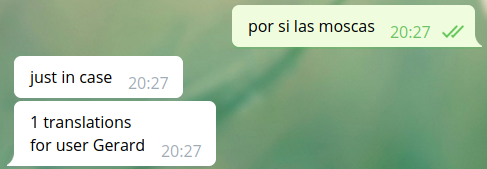
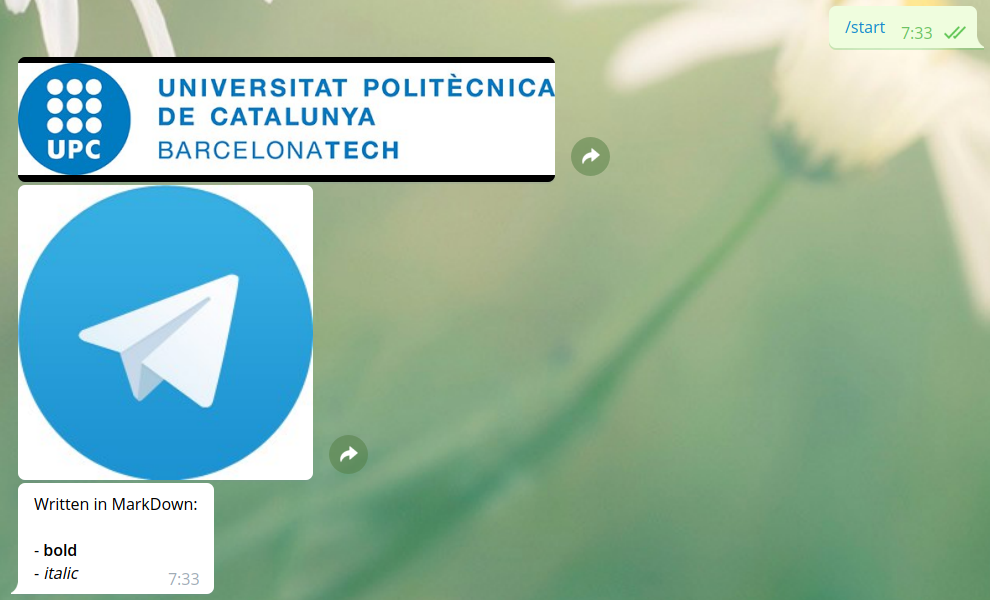
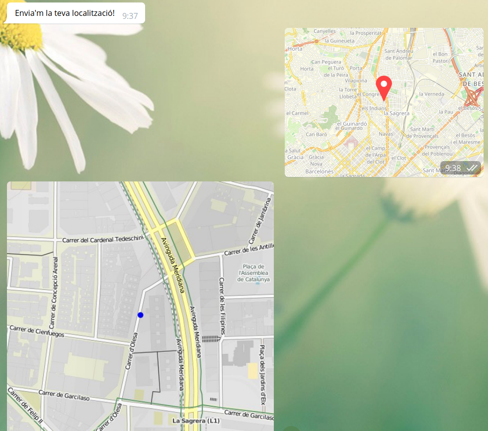
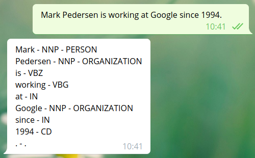

class: center, middle

Llenguatges de Programació

# Python 3: telegram bots

Gerard Escudero i Jordi Petit

<br>


<br>

Universitat Politècnica de Catalunya, 2019

---

# Hello world!

.col5050[
.col1[
L'exemple mostra el *Hello world!* <br> a telegram.

La comanda típica per iniciar un <br> bot és `/start`.

Requeriments:
* Telegram (ordinador i *smartphone*)

* Python3

* *python-telegram-bot* (amb `pip`)

* Visitar @BotFather ([enllaç](https://core.telegram.org/bots#6-botfather))

Guardeu l'*access token* en un arxiu <br> `token.txt`.
]
.col2[

]
]

---

# Exemple de codi

```python3
# importa l'API de Telegram
from telegram.ext import Updater, CommandHandler

# defineix una funció que saluda i que s'executarà quan el bot rebi el missatge /start
def start(update, context):
    context.bot.send_message(chat_id=update.message.chat_id, text="Hello World!")

# declara una constant amb el access token que llegeix de token.txt
TOKEN = open('token.txt').read().strip()

# crea objecte per treballar amb Telegram
updater = Updater(token=TOKEN, use_context=True)

# indica que quan el bot rebi la comanda /start s'executi la funció start
updater.dispatcher.add_handler(CommandHandler('start', start))

# engega el bot
updater.start_polling()

```

---

# Accés al missatge

Bot traductor amb `/tr`:

```python3
...
# requirements: pip install googletrans
from googletrans import Translator
...
# defining callback function for the /tr command
def tr(update, context):
    translator = Translator()
    msg = update.message.text[3:] # delete "/tr "
    msg_tr = translator.translate(msg).text
    context.bot.send_message(chat_id=update.message.chat_id, text=msg_tr)
...
# handling callbacks functions to the commands
updater.dispatcher.add_handler(CommandHandler('tr', tr))
...
```


---

# Accés als arguments

Tracta cada paraula del missatge com un argument:

```python3
...
# defining callback function for the /tr command
def tr(update, context):
    translator = Translator()
    miss_orig = ' '.join(context.args)
    miss_trad = translator.translate(miss_orig).text
    context.bot.send_message(chat_id=update.message.chat_id, text=miss_trad)
...

# handling callbacks functions to the commands
updater.dispatcher.add_handler(CommandHandler('tr', tr, pass_args=True))
...
```


---

# Guardant informació I

Utilitza el diccionari `user_data` per guardar informació de la conversa:

```python3
...
def tr(update, context):
    if 'counter' not in context.user_data:
        context.user_data['counter'] = 0
    context.user_data['counter'] += 1

    translator = Translator()
    miss_orig = ' '.join(context.args)
    miss_trad = translator.translate(miss_orig).text
    context.bot.send_message(chat_id=update.message.chat_id, text=miss_trad)
    report = str(context.user_data['counter']) + translations\nfor user ' + \
             update.message.chat.first_name
    context.bot.send_message(chat_id=update.message.chat_id, text=report)
...
```

---

# Guardant informació II



---

# Tractament sense comanda I

Canvia la forma del *callback*!

```python3
...
from telegram.ext import MessageHandler, Filters
...
def tr(update, context):
    translator = Translator()
    msg = update.message.text
    msg_tr = translator.translate(msg).text
    context.bot.send_message(chat_id=update.message.chat_id, text=msg_tr)
...

# handling callbacks functions to the commands
updater.dispatcher.add_handler(MessageHandler(Filters.text, tr))
...
```
---

# Tractament sense comanda II



---

# Multimedia I

A l'exemple s'envia una foto desde *url*, una des d'arxiu i un text en *markdown*:

```python3
...
from telegram import ParseMode

def start(update, context):
    info = '''
Written in MarkDown:
- *bold*
- _italic_
'''
    context.bot.send_photo(chat_id=update.message.chat_id, \
         photo='https://www.upc.edu/++theme++homeupc/assets/images/' + \
         'logomark.png')
    context.bot.send_photo(chat_id=update.message.chat_id, \
         photo=open('t_logo.png', 'rb'))
    context.bot.send_message(chat_id=update.message.chat_id, text=info, \
         parse_mode=ParseMode.MARKDOWN)
...
```

De forma de similar:
* `ParseMode.HTML`
* `send_video` i `send_audio`

---

# Multimedia II



---

# Mapes i localització I

```python3
import random
import os
from staticmap import StaticMap, CircleMarker
from telegram.ext import Updater, CommandHandler, MessageHandler, Filters

def start(update, context):
    context.bot.send_message(chat_id=update.message.chat_id, \
                     text="Send me your location!")

def where(update, context):
    ...

TOKEN = open('token.txt').read().strip()

updater = Updater(token=TOKEN)

updater.dispatcher.add_handler(CommandHandler('start', start))
updater.dispatcher.add_handler(MessageHandler(Filters.location, where))

updater.start_polling()
```

---

# Mapes i localització II

```python3
def where(update, context):
    try:
        name = "%d.png" % random.randint(1000000, 9999999)
        lat, lon = update.message.location.latitude,
        update.message.location.longitude
        mapa = StaticMap(500, 500)
        mapa.add_marker(CircleMarker((lon, lat), 'blue', 10))
        imatge = mapa.render()
        imatge.save(name)
        context.bot.send_photo(chat_id=update.message.chat_id, \
                       photo=open(name, 'rb'))
        os.remove(name)
    except Exception as e:
        print(e)
        context.bot.send_message(chat_id=update.message.chat_id, \
                         text='Something goes wrong!')
```

⚠️ La localització s'ha d'enviar amb l'*smartphone* !

---

# Mapes i localització III



---

# nltk I

```python3
from telegram.ext import Updater, MessageHandler, Filters
from nltk import word_tokenize, pos_tag, ne_chunk
from nltk.tree import Tree

def Tree2Str(t):
    ...

def psr(update, context):
    sentence = update.message.text
    res = ne_chunk(pos_tag(word_tokenize(sentence))) # nltk
    s = '\n'.join(Tree2Str(res))
    context.bot.send_message(chat_id=update.message.chat_id, text=s)

TOKEN = open('token.txt').read().strip()

updater = Updater(token=TOKEN)

updater.dispatcher.add_handler(MessageHandler(Filters.text, psr))

updater.start_polling()
```

---

# nltk II



---

# nltk III

Estructura *nltk*:

```
Tree(’S’, [Tree(’PERSON’, [(’Mark’, ’NNP’)]), Tree(’ORGANIZATION’,
[(’Pedersen’, ’NNP’)]), (’is’, ’VBZ’), (’working’, ’VBG’), (’at’,
’IN’), Tree(’ORGANIZATION’, [(’Google’, ’NNP’)]), (’since’, ’IN’),
(’1994’, ’CD’), (’.’, ’.’)])
```

Funció per tractar-la:

```python3
def Tree2Str(t):
    if isinstance(t, Tree):
        if t.label() == 'S':
            return [Tree2Str(e) for e in t]
        else:
            cs = [e for e in t]
            return ' '.join([e[0] for e in cs]) + ' - ' + \
                   cs[0][1] + ' - ' + t.label()
    else:
        return t[0] + ' - ' + t[1]
```

---

# Referències

* [Apunts *Bots de Telegram*](https://lliçons.jutge.org/python/telegram.html)

* [Documentació llibreria *python-telegram-bot*](https://python-telegram-bot.readthedocs.io/en/latest/index.html)

* [Documentació *Botfather*](https://core.telegram.org/bots#6-botfather)
